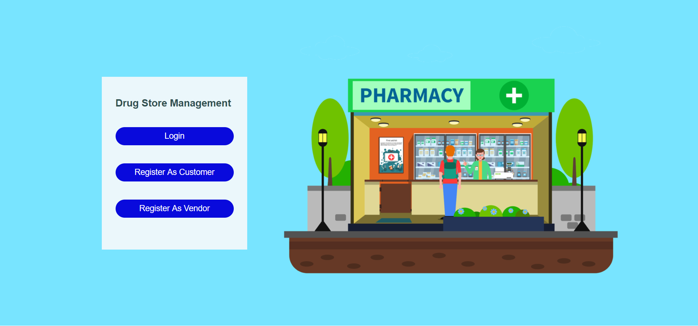
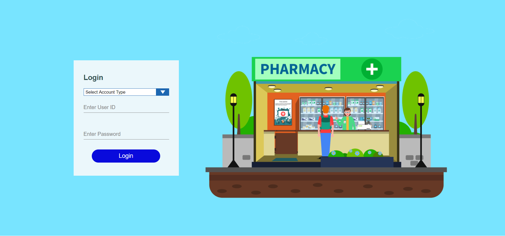

<div align="center">

# 💊 Pharmacy Drug Management System
**A Hyper-Premium, 3D Full-Stack Platform for Modern Healthcare**


</div>

---

## 🌟 Overview

Welcome to the **Pharmacy Drug Management System**—a revolutionary approach to digital pharmacy interfaces. Transforming a legacy system into a bleeding-edge web application, this platform offers a sleek, dark neon glassmorphism aesthetic enhanced with rich 3D UI/UX elements, real-time shaders, and an incredibly fluid user experience.

Whether you're a **Customer** looking to order life-saving medications or a **Seller** managing inventory, our platform delivers an intuitive, secure, and blazing-fast experience. 

---

## ✨ Key Features

### 🎨 Hyper-Premium 3D UI/UX
- **Immersive Interface**: A jaw-dropping design featuring dark neon glassmorphism.
- **Micro-Animations**: Butter-smooth 3D shaders and physics-based interactions for a vibrant, responsive feel.
- **Dynamic Views**: Real-time product cards, fluid page transitions, and elegant data representation.

### 🛡️ Robut Security & Authentication
- **Dual-Role Dashboards**: Secure, distinct portals for Customers and Sellers.
- **Stateless Authentication**: Protected API endpoints utilizing modern JWT (JSON Web Tokens).
- **Encrypted Data**: Enforced bcrypt password hashing keeping user credentials safe.

### 💸 Seamless Checkout & Payments
- **Integrated Payment Gateways**: Prioritized **PhonePe** integration with seamless fallback to **PayPal** for immediate, reliable processing.
- **Cart & Order Management**: Real-time stock update, smooth checkout flow, and detailed order histories.

### ⚙️ Modern Backend Architecture
- **Spring Boot REST API**: High-performance backend replacing legacy JSP/JDBC architectures.
- **Data Integrity**: Optimized MySQL database featuring intelligent pooling, fully seeded with over 25 realistic medicine profiles and prices.

---

## 🏗️ Technology Stack

| Tier | Technologies Used |
| :--- | :--- |
| **Frontend** | React, Vite, Tailwind/Vanilla CSS, Three.js (for 3D UI) |
| **Backend** | Java, Spring Boot, Spring Security, Hibernate (JPA) |
| **Database** | MySQL, JDBC Connection Pooling |
| **Payments** | PhonePe integration (Fallback: PayPal) |

---

## 🚀 Getting Started

### Prerequisites
- **Node.js** (v18+)
- **Java JDK 17+**
- **Maven**
- **MySQL Server**

### 1. Database Setup
Ensure MySQL is running. Create a schema named `db_pharmacy` (or as configured in your application.properties) and run the provided SQL scripts in the root directory to seed your product and user tables.

### 2. Backend Installation (Spring Boot)
Open a terminal in the `./backend` directory:
```bash
# Clean and install dependencies
mvn clean install

# Run the backend service on localhost:8080
mvn spring-boot:run
```

### 3. Frontend Installation (React + Vite)
Open a separate terminal in the `./frontend` directory:
```bash
# Install dependencies
npm install

# Start the blazing-fast Vite development server
npm run dev
```
Navigate to `http://localhost:5173` to experience the 3D magic.

---

## 📸 Screenshots & Visuals
*(Note: Upload screenshots of your incredible 3D UI to the `/Screenshots` folder and reference them here!)*

<p align="center">
  
  
</p>

---

## 🤝 Contributing
Contributions are what make the open-source community such an amazing place to learn, inspire, and create. Any contributions you make are **greatly appreciated**.

1. Fork the Project
2. Create your Feature Branch (`git checkout -b feature/AmazingFeature`)
3. Commit your Changes (`git commit -m 'Add some AmazingFeature'`)
4. Push to the Branch (`git push origin feature/AmazingFeature`)
5. Open a Pull Request

---

<div align="center">
Made with ❤️ by <a href="https://github.com/manideep997">manideep997</a>
</div>
